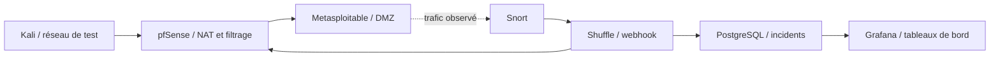

# PFA — Détection et réponse automatisée aux incidents réseau

Laboratoire SOC/SOAR basé sur Snort, Shuffle, pfSense, PostgreSQL et Grafana, réalisé sous VMware. Kali Linux et Metasploitable servent aux scénarios de validation en laboratoire.

## Contenu

- `snort/local.rules` : règles personnalisées retrouvées dans les scripts de réalisation.
- `scripts/snort_shuffle_watcher.sh` : traitement des alertes et transmission JSON.
- `scripts/snort_shuffle_relay.py` : relais HTTP vers le webhook Shuffle.
- `docs/RECONSTRUCTION.md` : architecture et étapes de remise en place des VM.

Les endpoints privés ont été remplacés par des variables d'environnement. Les disques virtuels, identifiants, captures non contrôlées et journaux privés ne sont pas publiés. Les sauvegardes VMware restent sur le PC.

## Statut

Ce dépôt documente le laboratoire existant et conserve les scripts retrouvés. Il ne constitue pas une installation entièrement automatique. Les modèles anonymisés Shuffle et pfSense, le dashboard Grafana et un schéma SQL reconstruit sont inclus. Voir `docs/IMPORT.md` pour leur configuration et leurs limites. La chaîne réelle Kali → Snort → Shuffle → pfSense → PostgreSQL a été validée en laboratoire : HTTP 200 avant le test, blocage du trafic après détection et HTTP 200 après nettoyage. Deux nouveaux incidents ont été enregistrés. Voir [les résultats et limites](docs/VALIDATION.md#validation-réelle-de-la-chaîne--8-octobre-2026).

## Définitions des VM

Le dossier `vms/` contient quatre fichiers VMware VMX anonymisés et un manifeste des disques. Les disques VMDK restent dans la sauvegarde locale : voir `vms/README.md` avant utilisation. Les résultats de tests réels sont dans `docs/VALIDATION.md`.
