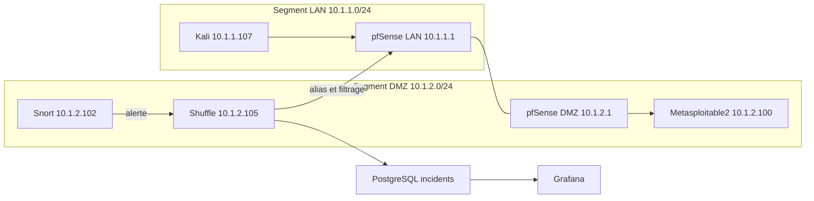

# Validation avec deux segments LAN VMware

## Architecture utilisée

Les segments distincts étaient déjà configurés dans les VM actives. Kali utilise eth1 pour le scénario, avec une route vers la DMZ via pfSense ; Snort et Metasploitable utilisent le second segment. Les interfaces NAT et WAN historiques n'ont pas été supprimées. Elles ne constituent pas le trajet du scénario LAN vers DMZ.

## Résultat du 8 octobre 2026

- Accès initial à la cible : HTTP 200 via eth1.
- Déclencheur : trois requêtes ICMP de Kali vers Metasploitable2.
- Alertes Snort actuelles : SID 1000002 et 100001, source 10.1.1.107, destination 10.1.2.100.
- Une exécution observée termine FINISHED avec trois actions HTTP SUCCESS (alias, application et enregistrement).
- Incidents PostgreSQL pour cette source : 2 avant, 4 après, soit deux nouveaux incidents.
- Nouvelle connexion HTTP bloquée : code 000 et expiration curl 28.
- Après restauration de l'alias et nettoyage de l'état de test : HTTP 200, curl 0.
- L'action Gmail a été temporairement retirée pendant le scénario puis restaurée. Aucun nouveau courriel de test demandé ni envoyé par ce scénario ; sa validation indépendante figure dans STATUT.md.

Les preuves texte et le résumé JSON sont dans preuves/deux-segments-*. La commande de collecte utilise l'heure UTC de Windows ; les alertes portent le fuseau propre au capteur.

## Limites

Le test valide le scénario interne entre deux segments et la réponse automatisée existante. La couverture des 15 SID est établie séparément par PCAP synthétique ; ce test ICMP ne démontre pas 15 attaques réelles. La restauration de Metasploitable2 est validée séparément. Une installation complète sur systèmes vierges et un accès entrant depuis Internet public ne sont pas validés par ce scénario. Le routeur domestique n'est pas accessible pour ce dernier test.