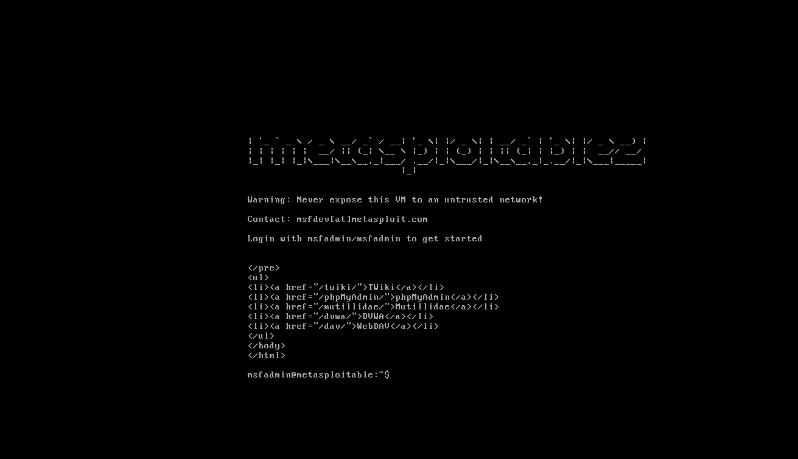

# Restauration isolée Metasploitable2 — 8 octobre 2026

## Résultat actuel

La copie indépendante démarre, permet une connexion utilisateur et renvoie la page web Metasploitable sur la boucle locale. Ces observations valident la restauration de la cible et son service web local.

- Source : sauvegarde indépendante Metasploitable-cl1.vmdk ; disque de production conservé.
- Cohérence de la chaîne VMDK contrôlée avant copie et après le premier essai arrêté : Disk chain is consistent.
- Modèle VM public utilisé avec carte réseau désactivée.
- Console observée dans VMware : connexion réussie de msfadmin, Linux 2.6.24-16-server i686 et invite de shell.
- Après les commandes demandées, l'utilisateur a fourni une capture montrant le contenu HTML de la page Metasploitable : liens TWiki, phpMyAdmin, Mutillidae, DVWA et WebDAV, puis retour à l'invite.

## Portée de la preuve

La capture atteste le contenu reçu et le retour au shell ; elle ne montre ni la ligne curl ni les en-têtes HTTP. Aucun code HTTP précis n'est donc attribué à cette vérification. Les sorties uname et df ne sont pas visibles sur cette capture.

Le test porte sur une sauvegarde préconfigurée de Metasploitable2. Il ne constitue pas une reconstruction complète du laboratoire sur systèmes vierges ni un accès entrant depuis Internet public.